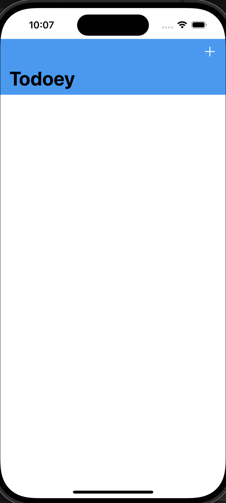
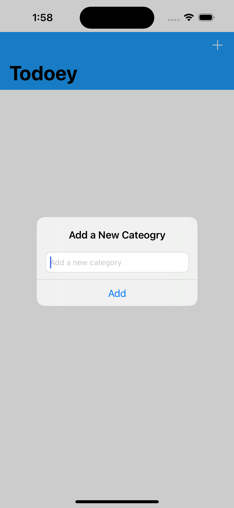
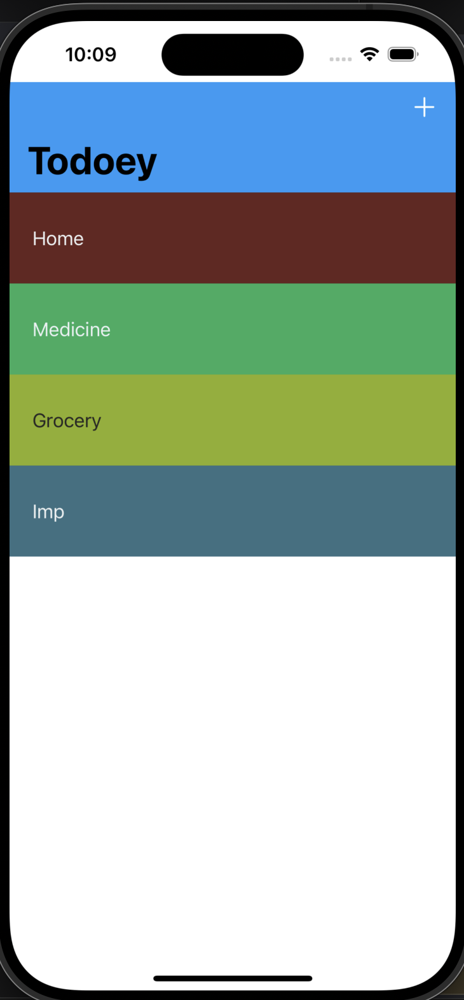
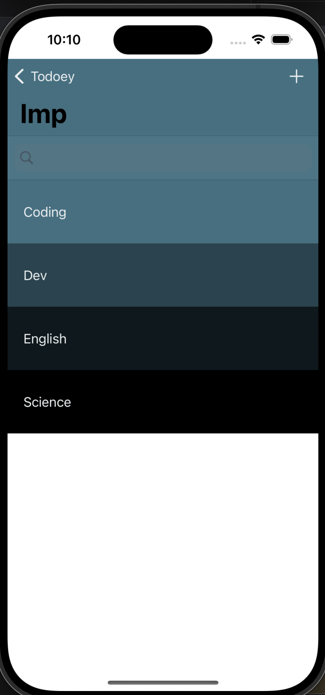
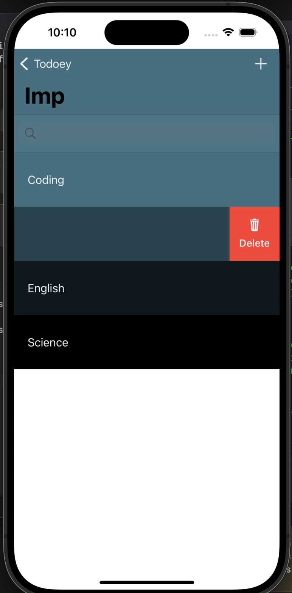

# Todoey

Todoey is a task management app built using SwiftUI for iOS. The app allows users to create, manage, and organize their to-do lists efficiently.

## Features

Add and Delete Tasks
Mark Tasks as Complete
Organize Tasks into Categories
Search for Tasks
Persistent Data Storage

## Screenshots

<table>
  <tr>
    <td>
      
      <br>
      <em>Home</em>
    </td>
    <td>
      
      <br>
      <em>Add category</em>
    </td>
    <td>
      
      <br>
      <em>Categories</em>
    </td>
  </tr>
  <tr>
    <td>
      
      <br>
      <em>Sub Categories</em>
    </td>
    <td>
      
      <br>
      <em>Delete</em>
    </td>
  </tr>
</table>


## Requirements

iOS 14.0+
Xcode 12.0+
Swift 5.0+

## Installation

1. Clone the repository:
    ```bash
    git clone https://github.com/aniket-singh-01/swift.git
    ```
2. Navigate to the project directory:
    ```bash
    cd swift/Development/Todoey
    ```
3. Open the project in Xcode:
    ```bash
    open todoey.xcodeproj
    ```
4. Run the project on a simulator or a connected device.

## Usage

Add tasks by clicking the "Add" button.
Organize tasks into different categories.
Mark tasks as complete by tapping on them.
Search for tasks using the search bar.

## Technologies Used

Swift
SwiftUI
Realm

## Contributing

Contributions are welcome! Please fork the repository and submit a pull request for any improvements or bug fixes.

## License

This project is licensed under the MIT License - see the [LICENSE](LICENSE) file for details.

## Contact

For any questions or suggestions, feel free to open an issue or contact me directly at dev.swiftnook@gmail.com
